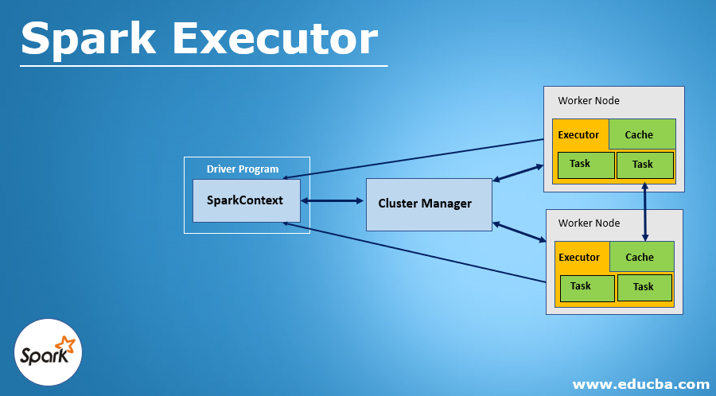
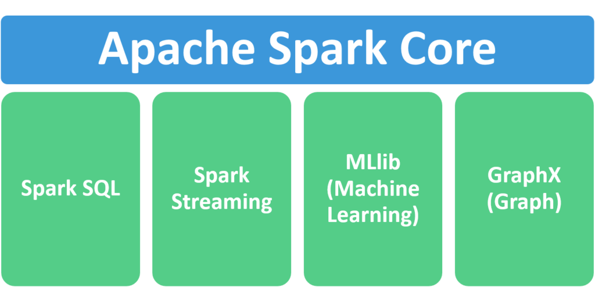

# Apache Spark with Scala

### Spark general information

- Fast
- Scalable
- 100x faster than Hadoop Map reduce
- DAG engine >> optimizes work
- Used by Amazon, Ebay, Nasa, Yahoo
- Code in Python, Scala and Java
- SQL with Datasets and Dataframes
- RDD 

- Spark itself is written in Scala
- Scala is a good fit for distributed processing

### RDD (Resilient Distributed Datasets)

Links with good content about:

https://pt.linkedin.com/pulse/apache-spark-rdd-vs-dataframe-dataset-jose-r-f-junior
https://sparkbyexamples.com/spark/spark-rdd-vs-dataframe-vs-dataset/
 
RDD Actions and transformations: 

### Dataframes

- Row objects
- Run SQL queries
- Has a schema
- Read and write Json, Hive, parquet, CSV or external databases
- Support a wide range of operations and transformations, such as filtering, aggregating, joining, and grouping data.

### Dataset

- Can only be used in compiled languages (Java and Scala)
- Faster detection of errors and better optimization 
- RDD can be converted to Dataset with .toDS()

"Spark's machine learning library and spark streaming engine use Datasets as their primary API instead of RDD's."

