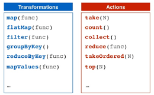

# Apache Spark with Scala

### Spark general information

- Fast
- Scalable
- 100x faster than Hadoop Map reduce
- DAG engine >> optimizes work
- Used by Amazon, Ebay, Nasa, Yahoo
- Code in Python, Scala and Java
- SQL with Datasets and Dataframes
- RDD 

- Spark itself is written in Scala
- Scala is a good fit for distributed processing

### RDD (Resilient Distributed Datasets)

Links with good content about:

https://pt.linkedin.com/pulse/apache-spark-rdd-vs-dataframe-dataset-jose-r-f-junior
https://sparkbyexamples.com/spark/spark-rdd-vs-dataframe-vs-dataset/
 
RDD Actions and transformations: 
